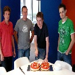
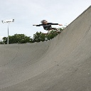
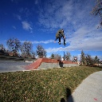
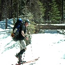
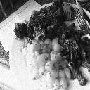
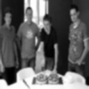
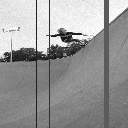
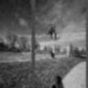
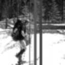

# ReseauxDeNeuronnes
Projet Reseaux de Neuronnes M2 S1

<!-- ========================================================= -->
<!--                         VAE-UNet                           -->
<!--        Image Restoration Inference (PyTorch, 128x128)       -->
<!-- ========================================================= -->

<p align="center">
  
</p>

<p align="center">
  <a href="#"></a>
  <a href="#"></a>
  <a href="#"></a>
  <a href="#"></a>
  <a href="#"></a>
</p>

<p align="center">
  <b>Script d'inférence</b> pour restaurer une image dégradée avec un modèle <code>VAE_UNet</code> (auto-detect GPU/CPU), sauvegarde une image restaurée en sortie.
</p>

---

# Contexte

Dans ce projet, nous adoptons trois approches distinctes basées sur des modèles génératifs : les Variational Autoencoders (VAE), privilégiant une reconstruction stable et cohérente, et les Generative Adversarial Networks (GAN), orientés vers la génération d’images ainsi que les réseaux de neurones convolutifs (CNN). Cette comparaison permettra d’analyser les avantages et les limites de chaque modèle dans le cadre de la restauration et de la colorisation d’images.

L'objectif ici est de savoir, pour notre cas, quel est le meilleur modèle.

Enfin, une dernière partie (bonus) pourra être dédiée à l’upscaling, dont l’objectif est d’augmenter la résolution des images restaurées afin d’améliorer leur qualité perceptuelle. Pour cela, nous allons implémenter un CNN. 

# Partie 0 : Organisation du projet

Une bonne organisation est nécéssaire pour une meilleure compréhension.


```text
.
├── data/
├── models/
│   └── VAE/
│        └── checkpoints/
│        └── output_vae/
│        └── vae_model.ipynb/
│   └── GAN/
│        └── checkpoints/
│        └── output_gan/
│        └── gan_model.ipynb/
│   └── CNN/
│        └── checkpoints/
│        └── output_cnn/
│        └── cnn_model.ipynb/
├── scripts/
│   └── preprocess_dataset.ipynb/
│   └── testVae.py/
│   └── testGan.py/
│   └── testCnn.py/
├── requirements.txt
└── README.md

```

# Partie 1 : Restauration d'images

Pour l'exécution des modèles entrainé, nous avons décidé d'utiliser un google collab (notament du à la taille des .pth et pour faciliter les phases d'exécution).

Lien du collab : https://colab.research.google.com/drive/1aqXILdJ1NoTIZO8X2fN-VoZoep5-uSW1?usp=sharing

## <span style="color:#FAC898">Dataset</span>

Le dataset utilisé est un dataset de ~60 000 images. Un prétraitement a été effectué sur celles-ci pour les détériorer.

Les nouvelles images ont les caractériques suivantes :
* Redimensionnement --> 128x128
* Passage de RGB à grayscale (1 canal)
* Ajout de bruits aléatoires : gaussien, sel et poivre, multiplicatif, corrélé, structuré
* Application d’un flou aléatoire
* Compression JPEG

### <span style="color:#39B52F">Exemple</span> : prétraitement image de base (haut) vs image dégradée (bas)

<table align="center">
  <tr>
    <th>Image 1</th>
    <th>Image 2</th>
    <th>Image 3</th>
    <th>Image 4</th>
    <th>Image 5</th>
    <th>Image 6</th>
  </tr>
  <tr>
    <td></td>
    <td></td>
    <td></td>
    <td></td>
    <td></td>
    <td></td>
  </tr>
  <tr>
    <td></td>
    <td></td>
    <td></td>
    <td></td>
    <td></td>
    <td></td>
  </tr>
</table>

## <span style="color:#FAC898">Approche VAE</span>

##  Prérequis (checkpoint)
 Prérequis (checkpoint)

>  Le script d’inférence nécessite le fichier **`vae_unet_best.pth`** (non inclus sur le repo).
> Place-le ici : `scripts/vae_unet_best.pth`

## Explication du modèle

--> parler de ce qu'on a fait --> vite fais genre montrer le modele et le train

##  Utilisation simple (Avant → Après)
 Utilisation simple (Avant → Après)

1. Ajouter une image dégradée nommée **`before.jpg`** dans le dossier `assets/`.
2. Lancer le script d’inférence.
3. L’image restaurée est générée automatiquement sous le nom **`after.jpg`** dans `assets/`.


 Le modèle travaille en résolution **128×128**.


##  Démo rapide (TL;DR)

```bash
# 1) Installer les dépendances
pip install -r requirements.txt

# 2) Lancer l'inférence
python scripts/infer_patch_vae_unet.py
```


##  Résultats — Avant / Après

<table align="center">
  <tr>
    <th>Avant ❌</th>
    <th>Après ✅</th>
    <th>Avant ❌</th>
    <th>Après ✅</th>
    <th>Avant ❌</th>
    <th>Après ✅</th>
  </tr>
  <tr>
    <td></td>
    <td></td>
    <td></td>
    <td></td>
    <td></td>
    <td></td>
  </tr>
  <tr>
    <td></td>
    <td></td>
    <td></td>
    <td></td>
  </tr>
</table>


##  Limites connues


-  Le modèle fonctionne **nettement mieux lorsqu’une seule personne** est présente dans l’image.
-  Les performances diminuent lorsque **plusieurs personnes** apparaissent simultanément.
-  La résolution est limitée à **128×128 pixels**, ce qui peut entraîner :
  - une perte de détails fins,
  - des artefacts sur les visages ou les contours complexes.
-  Ces limites sont liées :
  - à la capacité du modèle,
  - à la résolution d’entraînement,
  - et à la distribution des données d’apprentissage.


---

## <span style="color:#FAC898">Approche GAN</span>

## Explication du modèle

### Générateur <span style="color:#FFee83">G</span> :

* Réseau encodeur–décodeur de type U-Net

* **Encodeur** :
  * 3 couches convolutionnels qui réduit la résolution

* **Décodeur** :
  * 3 couches d'upsampling qui reconstruisent l’image

  * Des skip-connections sont utilisées pour diminuer la perte de détails (dans les couches intermédiaires)

### Discriminateur <span style="color:#FFee83">D</span> :

* CNN conditionnel --> évalue si une image est réelle ou générée

**Principe** :
* L'image dégradée et la réelle (ou la générée) sont données en input.
* Plusieurs couches convolutionnelles sont faites.
* Renvoie un 'panel/carte' de score indiquant le réalisme local de l’image.
  
### Training :

L’entraînement alterne entre le Discriminateur et le Générateur.

À chaque époque, l’entraînement se déroule comme suit :

#### 1. Discriminateur (1 mise à jour)
* Le discriminateur est entraîné une fois pour distinguer les images réelles des images générées.

#### 2. Générateur (2 mises à jour)
Le générateur est entraîné deux fois afin de :
* **Tromper le discriminateur** (perte adversariale).
* **Rester proche de l’image cible** (perte L1).
* **Améliorer la qualité perceptuelle** (perte VGG).

#### 3. Ajustement du learning rate
Les taux d’apprentissage du générateur et du discriminateur sont mis à jour à la fin de chaque époque.

##  Démo / Test du modèle

```bash
# 1) Installer les dépendances
  pip install -r requirements.txt

# 2) Dans le script testGAN.py, renseigner :
  IMAGE_INPUT_PATH = "chemin de l'image à améliorer"
  IMAGE_OUTPUT_PATH = "data\\after.jpg"
  CHECKPOINT_PATH = "chemin du .pth à utiliser" 

# 2) Lancer le test
  python scripts/testGan.py
```

---

## <span style="color:#FAC898">Approche CNN</span>
---

# Partie 2 : Upscale

##  Upscale de l’image restaurée -- Algo de base


Un script d’upscaling basé sur **Real-ESRGAN** est fourni pour augmenter la résolution
de l’image restaurée (×4).

 Ce script est **expérimental** : il améliore la résolution visuelle mais peut introduire des artefacts.

### Fonctionnement

- Entrée : `assets/before.jpg` (image restaurée en 128×128)
- Sortie : `assets/after.jpg` (image upscalée ~512×512)
---


>  L’upscaling est indépendant du modèle **VAE-UNet** et n’améliore pas
> les détails sémantiques, uniquement la résolution visuelle perçue.

##  Upscale de l’image restaurée -- Notre propre CNN


