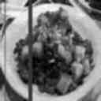
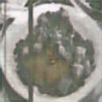
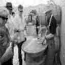
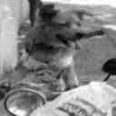
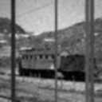

# ReseauxDeNeuronnes
Projet Reseaux de Neuronnes M2 S1

<!-- ========================================================= -->
<!--                         VAE-UNet                           -->
<!--        Image Restoration Inference (PyTorch, 128x128)       -->
<!-- ========================================================= -->

<p align="center">
  
</p>

<p align="center">
  <a href="#"></a>
  <a href="#"></a>
  <a href="#"></a>
  <a href="#"></a>
  <a href="#"></a>
</p>

<p align="center">
  <b>Script d'inférence</b> pour restaurer une image dégradée avec un modèle <code>VAE_UNet</code> (auto-detect GPU/CPU), sauvegarde une image restaurée en sortie.
</p>

---

## ✨ Démo rapide (TL;DR)

```bash
# 1) Installer les dépendances
pip install -r requirements.txt

# 2) Lancer l'inférence
python scripts/inference.py

## 🖼️ Résultats — Avant / Après

<p align="center">
  
  
</p>

<p align="center">
  
  
</p>

<p align="center">
  
  
</p>

<p align="center">
  
  
</p>

<p align="center">
  
  
</p>

<p align="center">
  <em>À gauche : image dégradée • À droite : image restaurée par le modèle VAE-UNet</em>
</p>


## ⚠️ Limites connues

- 🧍‍♂️ Le modèle fonctionne **nettement mieux lorsqu’une seule personne** est présente dans l’image.
- 👥 Les performances diminuent lorsque **plusieurs personnes** apparaissent simultanément.
- 🖼️ La résolution est limitée à **128×128 pixels**, ce qui peut entraîner :
  - une perte de détails fins,
  - des artefacts sur les visages ou les contours complexes.
- 🧠 Ces limites sont liées :
  - à la capacité du modèle,
  - à la résolution d’entraînement,
  - et à la distribution des données d’apprentissage.

